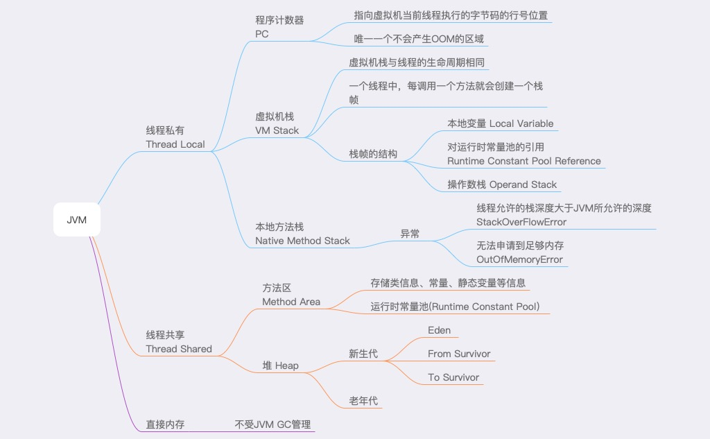
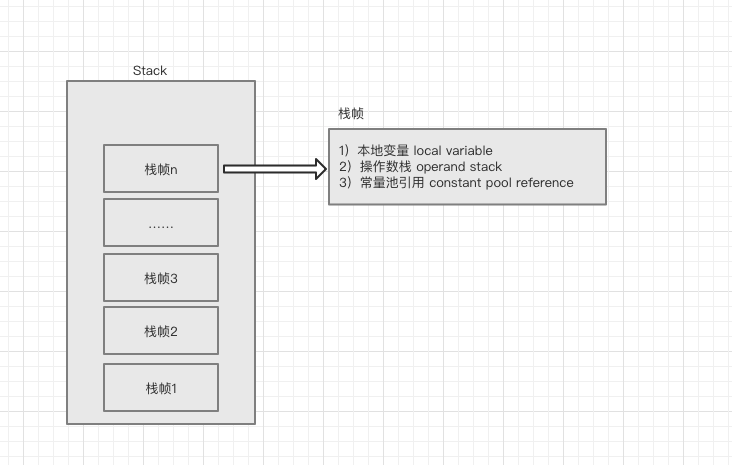

# JVM

## JVM的内存结构
Java虚拟机在运行时会将其自动管理的内存划分为以下几个区域：
   * 线程共享数据区域
       * 方法区（Method Area）
       * 堆区（Heap）
       
   * 线程私有数据区域
       * 程序计数器（Program Counter）
       * 虚拟机栈 （VM Stack）
       * 本地方法栈 (Native Method Stack)
       
   * 直接内存

   

###  具体如下

* 方法区（Method Area）
方法区是线程共享的区域，又被称为非堆区（Non-Heap）。
主要用于存储已被虚拟机加载的类信息、常量、静态变量、即时编译器编译后的代码等数据，根据Java 虚拟机规范的规定，当方法区无法满足内存分配需求时，将抛出OutOfMemoryError 异常。
在方法区中存在一个叫运行时常量池(Runtime Constant Pool）的区域，它主要用于存放编译器生成的各种字面量和符号引用，这些内容将在类加载后存放到运行时常量池中，以便后续使用。

* 堆区
Java堆也是线程共享的区域。
Java堆是虚拟机启动的时候就会创建的，也是Java 虚拟机所管理的内存中最大的一块。主要用于存放对象实例，几乎所有的Java对象示例都在这里分配内存。
Java 堆是垃圾收集器管理的主要区域，因此很多时候也被称做GC 堆。
如果在堆中没有内存完成实例分配，并且堆也无法再扩展时，将会抛出OutOfMemoryError 异常。

* 程序计数器
程序计数器是Java线程私有的区域。是一小块内存空间，是当前线程执行字节码行号的指示器。

* 虚拟机栈
Vm Stack 是线程私有的数据区域。与线程拥有相同的生命周期，代表Java方法执行时的内存模型。
每一个方法调用，都会创建一个新的栈帧（Stack Frame），栈帧中会存储本地变量，操作数栈，对常量池的引用等信息。
栈帧的结构如下：

* 本地方法栈

     本地方法栈属于线程私有的数据区域，这部分主要与虚拟机用到的 Native 方法相关，一般情况下，我们无需关心此区域。

* 直接内存

     直接内存并不是虚拟机运行时数据区的一部分。在JDK1.4中新加入了NIO(new Input/Output)类，引入了一种基于通道(channel)和缓冲区(Buffer)的IO方式，它可以使用native函数库直接分配堆外内存，然后通过一个存储在Java堆中的DirectByteBuffer对象作为这块内存的引用进行操作。这样能在一些场景中显著提高性能，因为避免了在Java堆和Native堆中来回复制数据。

     * 直接内存的分配不受堆大小的限制，受本子总内存大小的限制
     * 配置虚拟机参数时，不要忽略直接内存，防止出现OOM